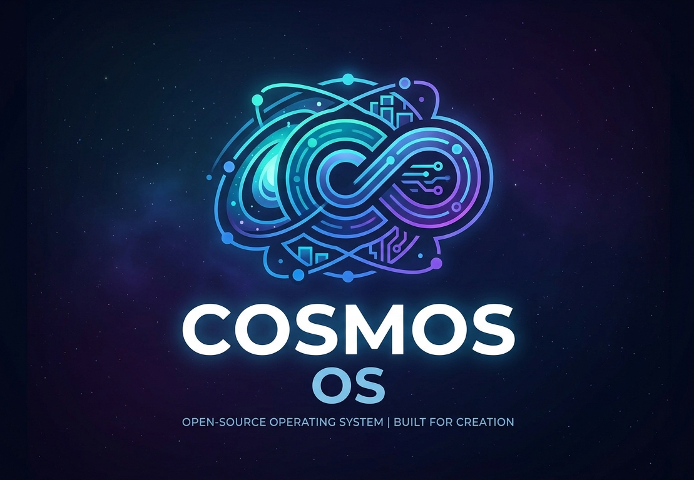

# Cosmos-OS

## Overview
**COSMOS** is a x86 32-bit Operating System written in C and Assembly. It features a custom 512-byte bootloader that initializes the system in 16-bit Real Mode, reads the kernel from the disk using BIOS interrupts, transitions the CPU into 32-bit Protected Mode, and hands execution over to a C-based kernel.

## Features
- **Custom Bootloader:** A heavily optimized 512-byte NASM bootloader with proper segment and stack initialization.
- **Disk Reading:** Utilizes BIOS `int 0x13` low-level disk services to load the kernel from the floppy image into physical memory at `0x1000`.
- **Protected Mode Transition:** Defines a Global Descriptor Table (GDT) and successfully switches the CPU from 16-bit Real Mode to 32-bit Protected Mode.
- **C Kernel Integration:** Bypasses the standard C library using a freestanding cross-compiled environment, allowing raw kernel logic to be written in C.
- **Direct VGA Output:** Prints directly to the screen by manipulating physical video memory at `0xB8000`.
- **Physical Memory Management:** A custom PMM utilizing bitmapped allocation to manage physical RAM, establish a dynamic memory heap, and protect reserved kernel regions from being overwritten.
- **Interrupt Handling and Timer:** Fully functioning hardware interrupt management including a Programmable Interval Timer for tracking system uptime.
- **Custom ATA PIO Driver:** Implements direct disk communication to read and write data without relying on legacy BIOS disk interrupts.
- **FAT32 File System:** Full support for the FAT32 architecture, including Long File Name decoding.
- **Directory Navigation:** Provides the ability to list root directories and navigate through folders using standard terminal commands.
- **File Operations:** Includes internal frameworks for opening and reading files directly from the storage drive.
- **CAT Command:** A built in utility command to read and display the text contents of files directly to the screen.
- **Asynchronous Scanf:** Implements non blocking keyboard input processing, allowing the OS to handle user commands asynchronously without freezing the execution state.

## Prerequisites
To compile and run this operating system, you must have the following tools installed on your host machine:
- **Make:** For automating the build process.
- **NASM:** The Netwide Assembler, used to compile the bootloader and kernel entry code.
- **i686-elf-gcc Toolchain:** A specialized cross compiler required to build flat binary operating system code without linking host OS libraries.
- **QEMU or Bochs:** For emulating the hardware and running the built floppy image.

## Directory Structure
Ensure your project files are organized as follows before building:
```
project_root/
|-- Makefile
|-- TEST.TXT
|-- welcome.txt
|-- source/
|   |-- bootloader/
|   |   |-- boot.asm
|   |-- kernel/
|       |-- headers/
|       |   |-- ports/
|       |   |   |-- ports_io.h
|       |   |-- storage
|       |   |   |-- ata.h
|       |   |-- cio.h
|       |   |-- clock.h
|       |   |-- fat32.h
|       |   |-- paging.h
|       |   |-- pmm.h
|       |   |-- string.h
|       |   |-- system.h
|       |-- main.asm
|       |-- kernel_entry.asm
|       |--kernel.c
|-- build/ (Generated automatically during compilation)
```
## Build Instructions
The build process is fully automated using the provided `Makefile`.
1. Open your terminal and navigate to the root directory of the project.
2. Run the following command to compile the bootloader, compile the kernel, link the binaries, and generate the bootable floppy image:
   
   ```bash
   make
   ```
4. The compiled bootloader, kernel object files, and the final `1.44MB floppy image (main_floppy.img)` will be placed inside the `build/` directory.
5. To clean the build directory and remove all compiled objects, run:

   ```bash
   make clean
   ```
## Running the OS
Once the build is complete, you can boot the operating system using QEMU by pointing it to the generated floppy image:
```bash
qemu-system-x86_64 -fda build/main_floppy.img
```
or just simply
```bash
make run
```
## Contributing to Cosmos-OS
Contributions are what make the open source community such an amazing place to learn, inspire, and create. Any contributions you make to this custom operating system project are greatly appreciated.

If you have a suggestion that would make this system better, please fork the repository and create a pull request. You can also simply open an issue with the tag "enhancement".

1. Fork the Project
2. Create your Feature Branch
3. Commit your Changes
4. Push to the Branch
5. Open a Pull Request

### Development Guidelines
* **Assembly Code:** Ensure all new bootloader or low level architecture code is written in NASM syntax and thoroughly commented, as bare metal debugging is complex.
* **C Kernel Code:** Maintain a freestanding environment. Do not include standard C libraries like stdio or stdlib, as they will break the cross compilation process.
* **Memory Management:** If modifying the Physical Memory Manager, ensure all reserved kernel regions remain protected in the bitmapped allocation to prevent system crashes.
* **Testing:** Test all changes using QEMU or Bochs before submitting a pull request to ensure the floppy image successfully boots and does not trigger a processor panic.
